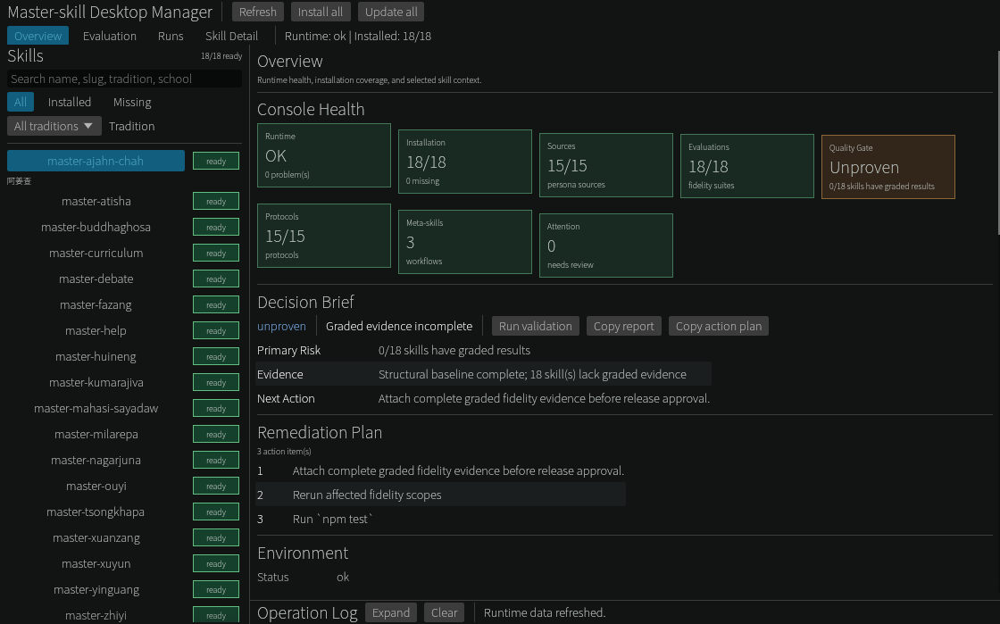

# Desktop Manager

> For maintainers and contributors: it is this repository's evaluation and quality console, and needs a **local clone** plus Python (the eval scripts) and Node.js (`bin/cli.mjs`).
> To use the masters you do not need it — `npx master-skill install --all` is enough; see [install.en.md](install.en.md).

A native desktop console (pure Rust, egui, single binary, no Electron) that unifies management of installation status, fidelity evaluation coverage, run tracing, and the quality gate across the prebuilt skills:



**Download**: [Releases](https://github.com/xr843/Master-skill/releases) provides pre-built binaries for Linux (x86_64), Windows (x86_64) and macOS (Apple Silicon / aarch64 only); run them from the root of a local clone (they call the repository's `scripts/` and `bin/`). From v0.12.1, on Linux/macOS, prefer the matching `.tar.gz`, which keeps the executable bit when extracted; the raw binaries remain for compatibility and need `chmod +x`. Each release from v0.12.1 carries `SHA256SUMS` — check a download with `sha256sum --check --ignore-missing SHA256SUMS` — and build-provenance attestations, verifiable with `gh attestation verify <file> --repo xr843/Master-skill` (needs a recent gh CLI: 2.51 fails with `unsupported tlog public key type`, 2.100 works). **No working Windows desktop binary exists before v0.12.1** — earlier ones cannot launch Python or npm, and v0.12.0 failed to build one; from v0.12.1 it resolves them per platform, and from v0.12.2 the release workflow runs the packaged binary on Linux, Windows and macOS hosts (`--help` and `--baseline`); if it still fails to find them, set `MASTER_SKILL_PYTHON` / `MASTER_SKILL_NPM`. The Windows binary is a console program, so double-clicking it also opens a console window. A GUI-subsystem build would remove that window, but when tested it crashed as soon as PowerShell redirected or piped its command-line output. The macOS binary is unsigned, so first launch still requires right-click → Open or `xattr -d com.apple.quarantine <file>`.

**Build from source** (Rust 1.95+):

```bash
cd desktop && cargo build --release
./target/release/master-skill-desktop            # GUI
./target/release/master-skill-desktop --baseline # headless fidelity dry-run baseline
```
